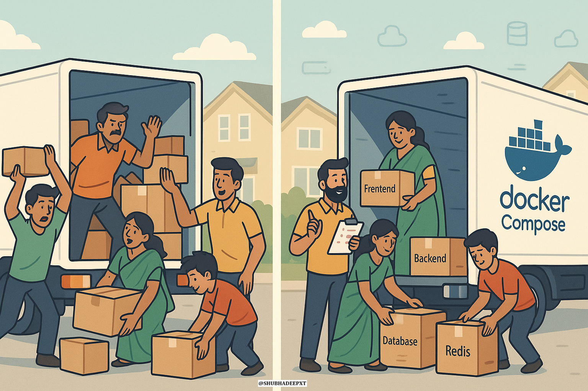

# 🐳 Docker Compose Analogy – Family Checklist for Containers 🧳

Managing containers manually is like moving house without coordination.

---

## 🏠 Real-Life Analogy

Moving morning chaos:
- Dad loading truck before mom finishes packing
- Brother loading random boxes
- Me hunting for missing things
- Truck driver confused = 💥

Then came the **Master Checklist**:
- Who does what (roles)
- When it should happen (timing)
- Dependencies mapped (mom → dad → truck)

That checklist = `docker-compose.yml`

---

## 🛠️ docker-compose.yml Example (Check the compose file in this folder)

---

## 💡 Key Lessons

| Concept      | Real Life                 | Docker Compose              |
|--------------|---------------------------|-----------------------------|
| Roles        | Mom, Dad, Me, Brother     | Services (frontend, db…)    |
| Checklist    | Master moving plan        | `docker-compose.yml`        |
| Coordination | Start only when ready     | `depends_on`                |
| One Command  | “Let’s move!”             | `docker-compose up`         |

---

## 🎯 Impact

- Before: 15 minutes of docker run juggling
- After: docker-compose up = 30 seconds

---

🔗 Related Posts
📘 LinkedIn Analogy Post- https://www.linkedin.com/feed/update/urn:li:activity:7355582811438764033/

---

