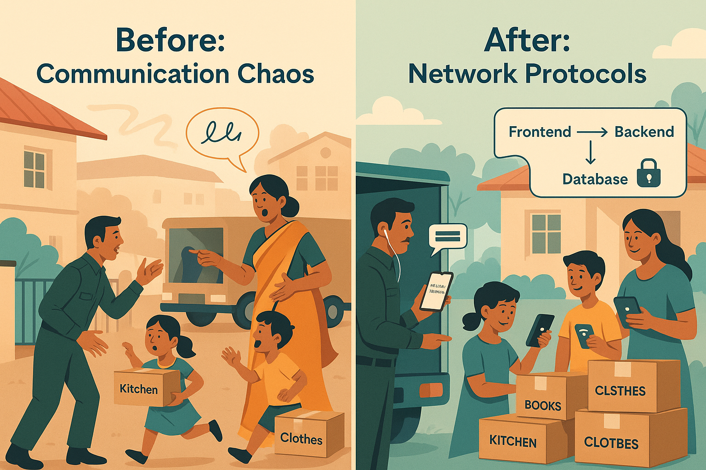

# 🐳 Docker Day 5: Networking = Family Communication Protocols 📡

On moving days, chaos ruled until my family set **clear communication channels**:
- Family group chat (everyone)
- Dad ↔ movers (external only)
- Mom + kids (internal)
- Parents-only secure channel (restricted)

That’s exactly what Docker networks do.

---

## 🧠 Mapping

| Real Life Channel     | Docker Network       | Purpose                          |
|-----------------------|----------------------|----------------------------------|
| Family group chat     | `public_web`         | Frontend ↔ Users                 |
| Mom + kids            | `internal_api`       | Frontend ↔ Backend               |
| Parents-only secure   | `database_secure`    | Backend ↔ Database only          |

---

## 🛠️ docker-compose.yml
Check the docker-compose file in the folder

---

## ✅ Best Practices

- Avoid putting all containers on the default bridge.
- Use custom networks for security and isolation.
- Expose only what’s needed (usually frontend).
- Database should never be directly exposed.

---

## 🔗 Related

📘 LinkedIn Analogy Post: https://www.linkedin.com/posts/shubhadeep-bhowmik-74b5a214b_devops-dockernetworks-docker-activity-7363217822765731840-6KHS?utm_source=social_share_send&utm_medium=member_desktop_web&rcm=ACoAACQ3Z6sBtqtI4dzrkB0aa4GwTQ0B8ESmbBw
🧵 Twitter Thread: https://x.com/XT1396/status/1957462577107394593

---

