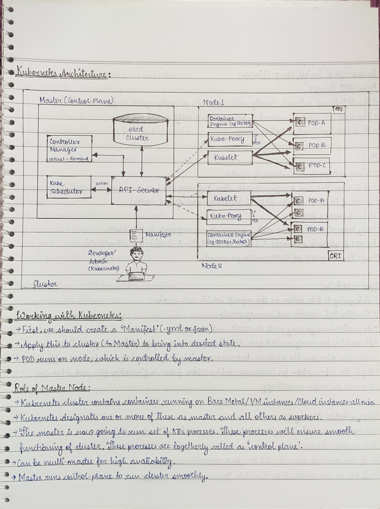

# 🧠 Kubernetes Architecture – Command Center Analogy

> K8s is like running a military operation at scale.
> You need a **Command HQ (Control Plane)** and multiple **Units (Worker Nodes)**.

---

## 🏢 Core Components

| Component            | Role                                   |
|----------------------|----------------------------------------|
| API Server           | Entry point (receives manifests)       |
| Scheduler            | Assigns Pods to Nodes                  |
| Controller Manager   | Ensures desired state (replicas, etc.) |
| etcd                 | Cluster "memory" (key-value store)     |
| Kubelet              | Node agent that runs Pods              |
| Kube Proxy           | Manages service networking             |

---

## 🏗️ Deployment Flow

1. Dev applies YAML (manifest) via `kubectl`
2. API server receives and validates
3. Scheduler decides where to run Pods
4. Kubelet on Node starts containers using CRI (e.g., Docker)

---

## 📄 Example Manifest

- Check the basic-pod.yml file

---

## 🖼  Diagram

---

🔗 Related
🐦 Twitter Post - https://x.com/XT1396/status/1950176781585305630
📷 Handwritten Notes

---

📌 Tip: Use kubectl get componentstatuses to check Control Plane health.

---

## 🎓 Credits
Learned from: Youtube:- Abhishek Veeramalla and Bhupinder Rajput (Technical Guftgu) and Real-world project breakdowns

#Kubernetes #DevOps #CloudNative #ContainerOrchestration
